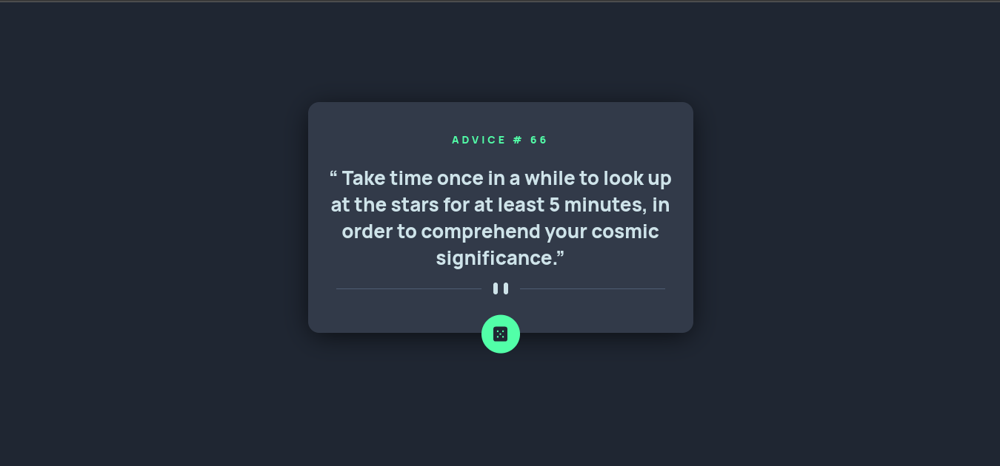

# Frontend Mentor - Advice generator app solution

This is a solution to the [Advice generator app challenge on Frontend Mentor](https://www.frontendmentor.io/challenges/advice-generator-app-QdUG-13db). Frontend Mentor challenges help you improve your coding skills by building realistic projects.

## Table of contents

- [Overview](#overview)
  - [The challenge](#the-challenge)
  - [Screenshot](#screenshot)
  - [Links](#links)
- [My process](#my-process)
  - [Built with](#built-with)
  - [What I learned](#what-i-learned)
  - [Continued development](#continued-development)
  - [Useful resources](#useful-resources)
- [Author](#author)


## Overview

### The challenge

Users should be able to:

- View the optimal layout for the app depending on their device's screen size
- See hover states for all interactive elements on the page
- Generate a new piece of advice by clicking the dice icon

### Screenshot


<small>More Screenshots, in the screenshots folder!</small>


### Links

- Solution URL: [Github Repo](https://github.com/EuCaue/advice-generator-app)
- Live Site URL: [Live Site](https://advice-generator-app-rouge.vercel.app/)

## My process

### Built with

- Semantic HTML5 (TSX) markup
- CSS custom properties
- Flexbox
- [React](https://reactjs.org/) - JS library
- [Styled Components](https://styled-components.com/) - For styles
- [Typescript](https://www.typescriptlang.org/) - For React
- [Axios](https://axios-http.com/) - For API requests
- [Vercel](https://vercel.com/) - For deploy the project


### What I learned

```tsx
<h1> ADVICE # {id} </h1>
<h2>{`\u{201C} ${slip}\u{201D}`}</h2>
```

```css
  @media only screen and (max-width: 40em) {
    width: 15.4em;
    height: 14.4em;

    ${DividerImg} {
      width: 13em;
      transform: translateY(3.2em);
    }

    form {
      padding-bottom: 2em;
    }

    ${DiceButton} {
      transform: translateY(4.6em);
    }
  }
}
```

```ts
async function adviceDefault(): Promise<void> {
    setIsLoading(true);
    try {
      const { data } = await axios.get<AdviceSlip>(
        `https://api.adviceslip.com/advice/${66}`,
      );

      setSlip(data.slip.advice);

      setID(data.slip.id);
}
```

### Useful resources

- [W3Schools](https://www.w3schools.com/) - This helped me a lot with css.

## Author

- Github - [EuCaue](https://www.github.com/EuCaue)
- Frontend Mentor - [@EuCaue](https://www.frontendmentor.io/profile/EuCaue)
- LinkedIn - [Caue Souza](https://www.linkedin.com/in/caue-souza/)

